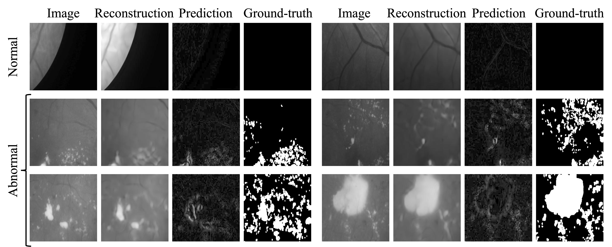

# WDMT-Net
This is an official implementation of 'A Multi-task Network with Weight Decay Skip Connection Training for Anomaly Detection in Retinal Fundus Images'. ([Accepted by MICCAI 2022](https://link.springer.com/chapter/10.1007/978-3-031-16434-7_63))

## A Multi-task Network with Weight Decay Skip Connection Training for Anomaly Detection in Retinal Fundus Images


## Requirements

*   numpy>=1.17.0
*   scipy>=1.5.2 
*   Pillow>=8.2.0
*   pytorch>=1.7.1
*   torchvision>=0.8.2
*   tqdm>=4.59.0
*   scikit-learn>= 0.24.2
*   scikit-image>=0.17.2

## Datasets 
The proposed method is evaluated on two publicly-available datasets, i.e. 

*   [IDRiD](https://www.sciencedirect.com/science/article/pii/S1361841519301033?casa_token=pO8u1MuAw1wAAAAA:Yx2KH3-xTfilsRS7Q_Nafrl3RgIeC4rMSuod14mlVWNOUF8OqD_THuZDaJglEsqJ2GfMUEhrO992)
*   [ADAM](https://ieeexplore.ieee.org/abstract/document/9768802)

## Usage
The proposed WDMT-Net method is trained through two steps:
*   Data Preparation
    
    Generate the list of HOG image and Patches :
    ```
    python3 data_find.py \
    --dataset ['IDRiD'/'ADAM'] \
    --path {data dir}
    ```
    
    For example, 
    `python3 data_find.py --dataset 'IDRiD' --path './dataset/' `
    
    And then you can get lists containing images and corresponding labels in './label/'. 
    
*   Training and testing model
     ```
     python3 main.py \
     --dataset ['IDRiD'/'ADAM'] \
     --datadir './labels/' \
     --hot \
     --lr 1e-4 \
     --batch_size 32 \
     --epochs 200 \
     --deta 0.05 \
     ```

## Visualization

